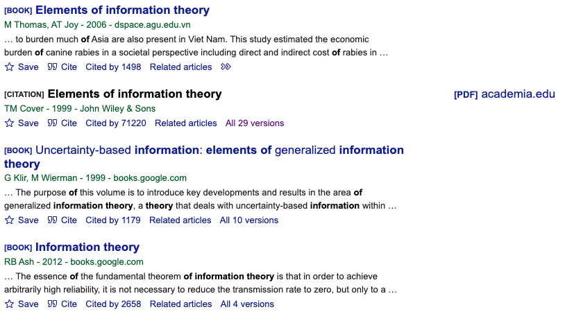

# BibTeX の使い方

BibTex は論文執筆において, 参考文献を簡単に管理できる有用なツールです. ここでは, 基本的な使い方を紹介したいと思います.

## 引用文献を探す

近年は, 引用してもらうために論文を公開している著者が多いです. そのため, ハイレベルな国際会議やジャーナルで発表された成果であっても, ググれば論文が見つかります.

論文を見つける際のおすすめは [google scholar](https://scholar.google.com/) です. ためしに, Elements of Information Theory という書籍を探してみたいと思います.　下記のとおり, 検索するとヒットした論文または書籍が表示されます.


まず, サイト名の右側に ``[PDF]arxiv.org`` みたいなリンクが表示されているケースがあります. これは, オーサ版の論文（または, 違法にアップロードされた論文）へのリンクです. このリンクを辿ることで, 論文を確認することができます. （最も多いのは arXiv へのリンクです. 多くの研究者は, 査読前の論文を先駆けて公開します. ）

次に, 一番下の青字について説明します.

- Cite: 引用するときに書くべき書誌情報が獲得できます. BibTeX では, このリンク先にあるものを利用します.
- Cited by 000: 論文を引用している出版物（or論文）の一覧です. 関連研究にあたるので, サーベイの際には確認しておくと良いです.
- All 00 versions: 様々な版を確認できます. 一見, PDF が得られなさそうなものであっても, このリンク先を辿ると獲得できる可能性があります.

## Bib を使って引用する

BibTex のリンクを辿ると, 次のようなことが書かれたページが見つかります. 自身の論文を管理しているフォルダに ``xxx.bib`` のようなファイルを作り, コピペします.

```bibtex
@book{cover1999elements
  title={Elements of information theory},
  author={Cover, Thomas M},
  year={1999},
  publisher={John Wiley \& Sons}
}
```

トップカンファレンスのプロシーディングスをリストしておきます. arXiv は査読前の論文も多く存在しますが, 下記のリンク先にある論文は低い採択率を抜けています:

- [OpenReview](https://openreview.net/): ICLR など
- [CVF Open Access](https://openaccess.thecvf.com/menu): CVPR, WACV, ICCV
- [NeurIPS Proceedings](https://papers.nips.cc/): NeurIPS（元々は NIPS でした. ただ, nips は教育上よろしくないという理由で今の表現になっているそうです）
- [PMLR](https://proceedings.mlr.press/): ICML など
- ECCV や AAAI?
